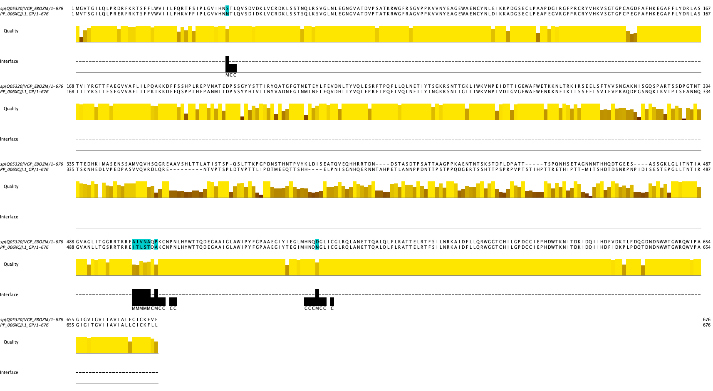

# Ebola Virus Glycoprotein Interface Mutations: Zaire vs Bundibugyo Strains

## Overview

Comparative sequence analysis of Ebola virus glycoprotein (GP) between Zaire and Bundibugyo strains reveals sequence variation at positions that contact antibodies in a known crystal structure. These observations identify candidates for further experimental investigation.

## Key Findings

### Interface Sequence Variation

- **21 antibody-contacting positions** mapped from PDB structure 3CSY (GP-antibody complex)
- **8 positions show sequence differences** between strains (38% of interface positions)
- **13 positions are identical** across strains (62% conservation rate)

### Sequence Differences at Interface Positions

The following positions differ between Zaire and Bundibugyo sequences:

| Position | Zaire | Bundibugyo | Region            | Chemical Class Change                      |
| -------- | ----- | ---------- | ----------------- | ------------------------------------------ |
| 41       | Ser   | Asn        | N-terminal        | Polar → Polar (within-class)               |
| 503      | Ala   | Ile        | GP1-GP2 junction  | Small hydrophobic → Larger hydrophobic     |
| 504      | Ile   | Thr        | GP1-GP2 junction  | Hydrophobic → Polar                        |
| 505      | Val   | Leu        | GP1-GP2 junction  | Hydrophobic → Hydrophobic (different size) |
| 506      | Asn   | Ser        | GP1-GP2 junction  | Polar → Polar (within-class)               |
| 507      | Ala   | Thr        | GP1-GP2 junction  | Small → Polar                              |
| 509      | Pro   | Ala        | GP1-GP2 junction  | Cyclic → Acyclic                           |
| 552      | Asp   | Asn        | C-terminal region | Charged acidic → Polar neutral             |

_Figure: Multiple sequence alignment of Ebola virus glycoprotein sequences showing sequence differences at antibody-contacting positions between Zaire and Bundibugyo strains._

### Structural Elements

**Disulfide Bridge Preserved**: Cysteines at positions **511** and **556** are identical in both strains (C511C, C556C). This disulfide bond is conserved across comparison, suggesting structural constraints may limit mutation in this region.

### Regional Clustering

The **GP1-GP2 junction region (positions 503-509)** contains the highest density of sequence variation, with differences at 6 of 7 positions in this cluster. This region warrants further investigation.

## Next Steps for Validation

To determine whether these sequence differences have functional consequences:

### Experimental Work Needed

- **Binding assays**: Test whether antibodies from the 3CSY structure bind both variant sequences
- **Cross-reactivity studies**: Evaluate existing monoclonal antibodies against both strains
- **Neutralization assays**: Measure whether sequence changes affect viral neutralization
- **Structural modeling**: Predict how mutations might alter protein structure (complement, not replace, wet lab work)

### Surveillance

- Document sequence variation in circulating Bundibugyo and Zaire strains
- Track whether the conserved cysteines (C511, C556) remain fixed across populations
- Monitor for correlation between sequence variation and clinical outcomes

## Methods

- Interface residues identified from PDB 3CSY crystal structure (GP-antibody complex)
- PISA interface definition with 5Å distance cutoff
- Sequence alignment performed with MAFFT
- Reference: Zaire ebolavirus (UniProt Q05320)
- Variant: Bundibugyo ebolavirus (PathoPlex PP_006XCJJ.1)

## Limitations

- **Single structure basis**: Interface definition depends on one crystal structure; other antibodies may contact different positions
- **No functional data**: Sequence differences do not automatically imply altered binding or immune escape
- **Snapshot comparison**: Two sequences represent strains at one point in time; within-strain variation not assessed
- **No population data**: Cannot determine whether these mutations are under selection, neutral, or strain-specific polymorphisms

## Data Availability

- Alignment files: `gp_aln.fasta`
- Jalview annotation: `interface_annotation.jva`
- Analysis notebook: `identify_mutations.ipynb`
- Structure: PDB 3CSY

---

_Computational analysis performed 2026-05-20 using sequence alignment and structural annotation tools. This work identifies regions for experimental validation, not functional characterization._
