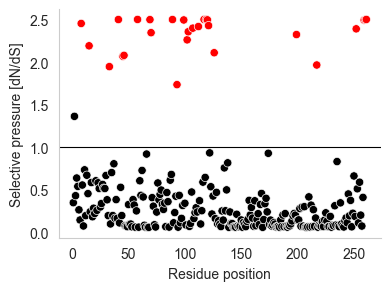
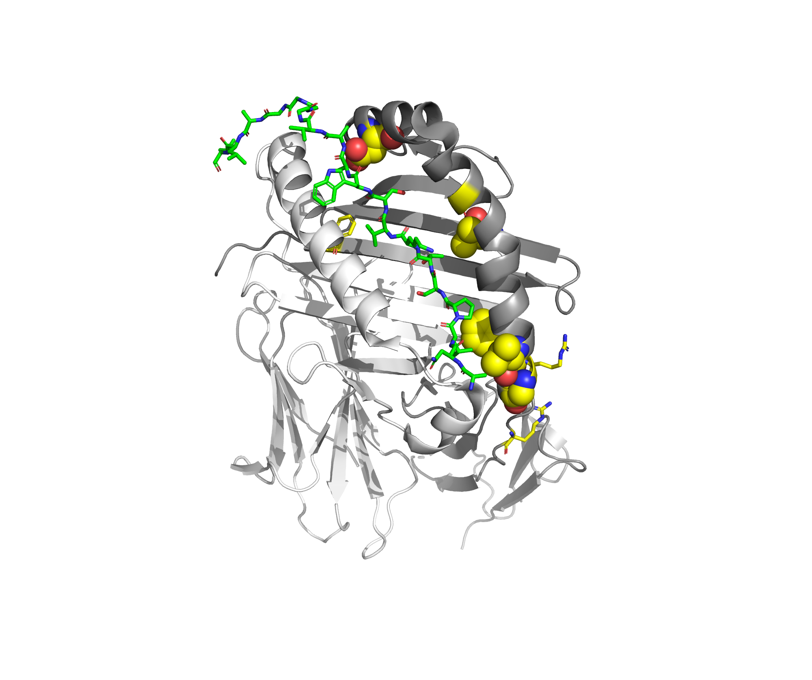

# Detecting pervasive positive selection with site-models from CodeML / PAML

Disclaimer: Please don't hesitate to contact me if there is anything which is not working on your
computer, or anything unclear, or even comments to improve it.


## Theoretical principles:

When mutations are advantageous for the fitness, they are propagated at a higher rate in the
population. The selective pressure can be computed by the dN/dS ratio (ω). dS represents the
synonymous rate (keeping the same amino acid) and dN the non-synonymous rate (changing the amino
acid). In the absence of evolutionary pressure (genetic drift), the synonymous and non-synonymous
rates are supposed to be equal, so the dN/dS ratio is equal to 1. Under purifying selection, natural
selection prevents the replacement of amino acidS, so the dN will be lower than the dS, and
dN/dS < 1. And under positive selection, when mutations are advantageous for the fitness, they are
propagated at a higher rate in the population, so the replacement rate of amino acid is favoured by
selection, and dN/dS > 1.

We can distinguish two types of positive selection: pervasive positive selection and episodic
positive selection. The former implies that a site will be under continuous changes (i.e. adapting
to pathogens under arm-race), while the later implies that a site will change once and then be kept
in the clade (i.e. providing an advantage in a new environment). We can detect the later using the
branch-site model, for which I wrote the previous [tutorial on branch-site](..//positive_selection/branch_site.md).

To detect pervasive positive selection, we will use the site models from CodeML/PAML. Those models
allow the clustering of aligned columns (sites) in different groups, each group having a different
dN/dS value. There are many different sites models in CodeML, all assuming that the dN/dS ratio is
the same across branches, but different between sites.

Here are the different models we will use in this tutorial:

- M0: one unique dN/dS for all sites. This is the most basic model.
- M1a: assumes two categories of sites: sites with dN/dS<1 (negative selection) and sites with
  dN/dS =1 (neutral evolution).
- M2a: assumes three categories of sites: sites with dN/dS<1 (negative selection), sites with
  dN/dS=1 (neutral evolution) and sites with dN/dS>=1 (positive selection).
- M3: assumes multiple categories of selection, not necessarily positive selection.
- M7: assumes 10 categories following a beta-distribution of sites, all with different dN/dS <=1.
- M8: assumes 10 categories following a beta-distribution of sites, grouped, all with different
  dN/dS <=1, and an additional 11th category with dN/dS >=1 (positive selection allowed).
- M8a: assumes 10 categories following a beta-distribution of sites, grouped, all with dN/dS <=1,
  and an additional 11th category with dN/dS =1 (no positive selection allowed).

## Practical

We will focus on the major histocompatibility complex (MHC) protein, which detects peptides from
pathogens. As this gene is in the front line against invaders, it is submitted to strong selective
pressure to rapidly detect new antigenic peptides. Early work on positive selection was focused on
the MHC, so this is a very good example for this practical.

The uniprot code is HLA class II histocompatibility antigen, DQ beta 1 chain.
The Ensembl gene id is: ENSG00000179344.

### Data preparation

Download data from Ensembl: <http://www.ensembl.org>

Go on Ensembl website, and search for ENSG00000179344

#### 1) Download orthologues sequence

Comparative Genomics => Orthologues => Download orthologues

Then choose: Fasta, Unaligned sequences – CDS).


#### 2) Download subtree

Comparative Genomics => Gene tree
Click on the blue node to select the following group: “Placental mammals ~100 MYA (Boreoeutheria)”
Gene Count 46

=> Export sub-tree Tree or Alignment
=> Format Newick, options "Full (web)" and "Final (merged) tree".

You have now two starting files:
- Sequences file: `Human_HLA_DQB1_orthologues.fa`
- Tree file: `HLA_DQB1_gene_tree.nh`

We are now going to process these files, in order to generate an alignment, visualise it, remove
spurious sequences and columns.

First, let’s rename these files to have shorter names

```shell
cp Human_HLA_DQB1_orthologues.fa HLA_DQB1.cds.fasta;
cp HLA_DQB1_gene_tree.nh HLA_DQB1.nh
```

Remove the species tag in the gene name

```shell
remove_ensembl_name_in_tree.py HLA_DQB1.nh > HLA_DQB1.tree
```

Extract gene names with Newick Utils (https://gensoft.pasteur.fr/docs/newick-utils/1.6/nwutils_tutorial.pdf)

```shell
nw_labels -I HLA_DQB1.tree > HLA_DQB1_names.txt
```

Extract CDS sequences that are in the tree, according to the extracted names
```shell
extract_sequences.py HLA_DQB1_names.txt HLA_DQB1.cds.fasta > HLA_DQB1_subset.cds.fasta
```

Translate CDS sequences to Amino Acid sequences using python script
```shell
translate_dna.py HLA_DQB1_subset.cds.fasta > HLA_DQB1_subset.aa.fasta
```

Make an alignment of these Amino Acid sequences
```shell
mafft-linsi HLA_DQB1_subset.aa.fasta > HLA_DQB1_subset.aa.mafft.fasta
```
Align CDS sequences by mapping them on the AA Alignment
```shell
realign_nuc_on_aa.py HLA_DQB1_subset.aa.mafft.fasta \
      HLA_DQB1_subset.cds.fasta \
      HLA_DQB1_subset.cds.mafft.fasta
```

```shell
move_target_sequence_to_top.py HLA_DQB1_subset.cds.mafft.fasta \
   HLA_DQB1_subset.cds.mafft.fasta ENSP00000407332
```

Move human sequence (`ENSP00000407332`) on top. This is to inform CodeML to
use this sequence as reference.

Optional: With Jalview, load the alignment `HLA_DQB1_subset.cds.mafft.fasta` and visualise it to
see if there isn’t anything wrong


Remove spurious sequences and columns with TrimAl
```shell
trimal -automated1 \
       -in HLA_DQB1_subset.cds.mafft.fasta \
       -resoverlap 0.75 \
       -seqoverlap 85 \
       -out HLA_DQB1_subset.cds.mafft.trimal.fasta \
       -htmlout HLA_DQB1_subset.cds.mafft.trimal.html \
       -colnumbering > HLA_DQB1_subset.cds.mafft.trimal.cols
```
Convert trimmed sequences from FASTA to PHYLIP
```shell
convert_fasta2phylip.py HLA_DQB1_subset.cds.mafft.trimal.fasta HLA_DQB1_subset.cds.mafft.trimal.phy
```
Extract gene names to id.list
```shell
grep ">" HLA_DQB1_subset.cds.mafft.trimal.fasta | cut -c 2- > id.list
```
Using Newick Utilities, we load the id file to extract a pruned subtree from the starting tree
(contains only the taxa from the alignment).
Note: CodeML needs tree with the number of taxa (here, n_taxa=35) and the number of trees (here:1)
```shell
id_list=$(cat id.list | xargs)
n_taxa=$(cat id.list | wc -l | sed 's/^[ \t]*//;s/[ \t]*$//')
n_trees="1"
echo "$id_list"
echo "$n_taxa $n_trees" > HLA_DQB1_subset.tree
eval "nw_prune -v HLA_DQB1.tree $id_list" >> HLA_DQB1_subset.tree
```


Now we end up with two files:
- Alignment: `HLA_DQB1_subset.cds.mafft.trimal.phy`
- Tree: `HLA_DQB1_subset.tree`

## 2) Estimation of evolutionary values

This is the core of the tutorial. We will use CodeML with three different control files (.ctl).
Each computation could take up to 90 minutes, depending om your CPU.

Compute many different site models: M0, M1a, M2a, M3 and M7.
The control file `HLA_DQB1_M0M1M2M3M7M8.ctl` is:
```
     seqfile = HLA_DQB1_subset.cds.mafft.trimal.phy  * sequence data file name
    treefile = HLA_DQB1_subset.tree                  * tree structure file name
     outfile = HLA_DQB1_M0M1M2M3M7M8.mlc             * main result file name

       noisy = 9   * 0,1,2,3,9: how much rubbish on the screen
     verbose = 1   * 1: detailed output, 0: concise output
     runmode = 0   * 0: user tree;  1: semi-automatic;  2: automatic
                   * 3: StepwiseAddition; (4,5):PerturbationNNI; -2: pairwise

     seqtype = 1   * 1:codons; 2:AAs; 3:codons-->AAs
   CodonFreq = 2   * 0:1/61 each, 1:F1X4, 2:F3X4, 3:codon table
       clock = 0   * 0: no clock, unrooted tree, 1: clock, rooted tree
      aaDist = 0   * 0:equal, +:geometric; -:linear, {1-5:G1974,Miyata,c,p,v}
       model = 0   * models for codons:
                   * 0:one, 1:b, 2:2 or more dN/dS ratios for branches
     NSsites = 0 1 2 3 7 8 * 0:one w; 1:NearlyNeutral; 2:PositiveSelection;
                           * 3:discrete; 4:freqs; 5:gamma;6:2gamma;
                           * 7:beta;8:beta&w;9:beta&gamma;10:3normal
       icode = 0   * 0:standard genetic code; 1:mammalian mt; 2-10:see below
       Mgene = 0   * 0:rates, 1:separate; 2:pi, 3:kappa, 4:all
   fix_kappa = 0   * 1: kappa fixed, 0: kappa to be estimated
       kappa = 2   * initial or fixed kappa
   fix_omega = 0   * 1: omega or omega_1 fixed, 0: estimate
       omega = 1   * initial or fixed omega, for codons or codon-based AAs
       getSE = 0       * 0: don't want them, 1: want S.E.s of estimates
RateAncestor = 0       * (0,1,2): rates (alpha>0) or ancestral states (1 or 2)
  Small_Diff = .45e-6  * Default value.
   cleandata = 0       * remove sites with ambiguity data (1:yes, 0:no)?
 fix_blength = 0       * 0: ignore, -1: random, 1: initial, 2: fixed
```

And execute it (this can take ~ 30-45 minutes):

```shell
codeml HLA_DQB1_M0M1M2M3M7M8.ctl
```

Important! Copy rst file to another name

```shell
cp rst HLA_DQB1_M0M1M2M3M7M8.rst.txt
```

One last thing is to compute the site model M8a, which is the same as M8, except we fix the dN/dS
to 1 (only negative selection and neutral evolution allowed). This will used as null model
against M8a. The control file `HLA_DQB1_M8a.ctl` is:
```
     seqfile = HLA_DQB1_subset.cds.mafft.trimal.phy   * sequence data file name
    treefile = HLA_DQB1_subset.tree                  * tree structure file name
     outfile = HLA_DQB1_M8a.mlc                      * main result file name

       noisy = 9   * 0,1,2,3,9: how much rubbish on the screen
     verbose = 1   * 1: detailed output, 0: concise output
     runmode = 0   * 0: user tree;  1: semi-automatic;  2: automatic
                   * 3: StepwiseAddition; (4,5):PerturbationNNI; -2: pairwise

     seqtype = 1   * 1:codons; 2:AAs; 3:codons-->AAs
   CodonFreq = 2   * 0:1/61 each, 1:F1X4, 2:F3X4, 3:codon table
       clock = 0   * 0: no clock, unrooted tree, 1: clock, rooted tree
      aaDist = 0   * 0:equal, +:geometric; -:linear, {1-5:G1974,Miyata,c,p,v}
       model = 0   * models for codons:
                   * 0:one, 1:b, 2:2 or more dN/dS ratios for branches
     NSsites = 8   * 0:one w; 1:NearlyNeutral; 2:PositiveSelection; 3:discrete;
                   * 4:freqs; 5:gamma;6:2gamma;
                   * 7:beta;8:beta&w;9:beta&gamma;10:3normal
       icode = 0   * 0:standard genetic code; 1:mammalian mt; 2-10:see below
       Mgene = 0   * 0:rates, 1:separate; 2:pi, 3:kappa, 4:all
   fix_kappa = 0   * 1: kappa fixed, 0: kappa to be estimated
       kappa = 2   * initial or fixed kappa
   fix_omega = 1   * 1: omega or omega_1 fixed, 0: estimate
       omega = 1   * initial or fixed omega, for codons or codon-based AAs
       getSE = 0       * 0: don\'t want them, 1: want S.E.s of estimates
RateAncestor = 0       * (0,1,2): rates (alpha>0) or ancestral states (1 or 2)
  Small_Diff = .45e-6  * Default value.
   cleandata = 0       * remove sites with ambiguity data (1:yes, 0:no)?
 fix_blength = 0       * 0: ignore, -1: random, 1: initial, 2: fixed
```

And execute (this can take ~ 5-10 minutes):
```shell
codeml HLA_DQB1_M8a.ctl
```

## 3) Results
### 3.1) Identification of positive selection

Have a look at the mlc files. If you want to retrieve the log-likelihood values:

```shell
grep "lnL" *.mlc
```
```
HLA_DQB1_M0M1M2M3M7M8.mlc:lnL(ntime: 68  np: 70):  -8548.085033      +0.000000
HLA_DQB1_M0M1M2M3M7M8.mlc:lnL(ntime: 68  np: 71):  -8204.116542      +0.000000
HLA_DQB1_M0M1M2M3M7M8.mlc:lnL(ntime: 68  np: 73):  -8153.581014      +0.000000
HLA_DQB1_M0M1M2M3M7M8.mlc:lnL(ntime: 68  np: 74):  -8127.631456      +0.000000
HLA_DQB1_M0M1M2M3M7M8.mlc:lnL(ntime: 68  np: 71):  -8196.676191      +0.000000
HLA_DQB1_M0M1M2M3M7M8.mlc:lnL(ntime: 68  np: 73):  -8123.349809      +0.000000
HLA_DQB1_M8a.mlc:lnL(ntime: 68  np: 72):  -8171.061567      +0.000000
```

The order of lines being: M0, M1, M2, M3, M7, M8 and M8a.
For each model, you directly get the number of parameters (np) and the log-likelihood value:

```
Model n.p. lnL
M0 70 -8548.0850
M1a 71 -8204.116542
M2a 73 -8153.581014
M3 74 -8127.631456
M7 71 -8196.676191
M8 37 -8123.349809
M8a 73 -8171.061567
```

Using these models, we can construct four likelihood-ratio tests (LRT), where three of them will
tell us if there is significant positive selection or not.

#### 3.1.1) M0-M3:
This one is an exception and will only tell us if there are different categories of sites under
different selective pressures. This test is not used to detect positive selection, and it is nearly
always significant.

```
2x(L1-L0) = 2x[(-8127.6315) – (-8548.085)] = 840.9070
d.f. = 74-70 = 4
=> 1.06E-180
````

#### 3.1.2) M1a-M2a:
This test was the first site model developed to detect positive selection. We
contrast a model with 2 classes of sites against a model with 3 classes of sites.
Degree of freedom = 2.
```
2x(L1-L0) = 2x[(-8153.5810) – (-8204.1165)] = 36.7513
d.f. = 73-71 = 2
=> 1.13E-22
```
The test is significant, so there is positive selection. This model is very conservative, and can
lack power under certain conditions.

#### 3.1.3) M7-M8:
This test also detects positive selection. We contrast a model with 10 classes of sites against a
model with 11 classes of sites.
Degree of freedom = 2.

```
2x(L1-L0) = 2x[(-8123.3498) – (-8196.6762)] = 146.6528
d.f. = 73-71 = 2
=> 1.43E-32
```

The test is significant, so there is positive selection. However, this model can have problem power
under certain conditions, and the following LRT is preferred.

#### 3.1.4) M8-M8a:
This is the latest test. We contrast a model with 11 classes of sites where positive
is not allowed (dN/dS=1) against a model with 11 classes of sites where positive is allowed
(dN/dS >=1).
Degree of freedom = 1.

```
2x(L1-L0) = 2x[(-8123.3498) – (-8171.0616)] = 95.4235
d.f. = 73-72 = 1
=> 1.54E-22
```

This is the preferred test, combining power and robustness.

### 3.2) Identification of sites

As these tests are significant, we can move to the next step, which is the precise identification of
sites under positive selection. If the previous step was not significant, we should not move to this
stage.

In your mlc file, under the section of Model M2a and M8 (the only ones that allow positive
selection), you will find a section called “Bayes Empirical Bayes (BEB) analysis
(Yang, Wong & Nielsen 2005. Mol. Biol. Evol. 22:1107-1118)”. This section contains the list that
have a BEB score \[Pr(w>1)] higher than 50%. BEB values higher than 95% are indicated by *and sites
with values higher than 99% are indicated by **. Sometimes, there is no site detected, which means
there is probably a problem in your analysis or dataset if your test is significant. Sometimes, you
will find a lot of sites, which seems worrying, but it just means the average BEB (baseline) is
slightly above 50%. The most interesting sites are those with a BEB>95% (* or**).

```
Bayes Empirical Bayes (BEB) analysis (Yang, Wong & Nielsen 2005. Mol. Biol. Evol. 22:1107-1118)
Positively selected sites (*: P>95%; **: P>99%)
(amino acids refer to 1st sequence: ENSP00000407332)

            Pr(w>1)     post mean +- SE for w

     8 R      0.971*        2.453 +- 0.275
    15 V      0.824         2.191 +- 0.672
    33 R      0.687         1.948 +- 0.824
    41 F      0.999**       2.499 +- 0.045
    45 G      0.744         2.069 +- 0.738
    46 M      0.749         2.079 +- 0.729
    58 L      1.000**       2.500 +- 0.003
    69 Y      0.999**       2.498 +- 0.057
    70 A      0.906         2.345 +- 0.483
    89 D      1.000**       2.499 +- 0.030
    93 W      0.551         1.736 +- 0.851
    99 V      0.996**       2.494 +- 0.097
   102 G      0.857         2.261 +- 0.585
   103 T      0.913         2.356 +- 0.467
   107 L      0.938         2.398 +- 0.399
   112 R      0.951*        2.417 +- 0.367
   117 V      1.000**       2.500 +- 0.003
   119 F      1.000**       2.500 +- 0.009
   120 R      0.997**       2.495 +- 0.092
   121 G      0.956*        2.428 +- 0.338
   126 R      0.784         2.111 +- 0.748
   199 R      0.898         2.323 +- 0.529
   217 T      0.684         1.967 +- 0.787
   252 R      0.935         2.390 +- 0.421
   259 L      0.996**       2.493 +- 0.103
   260 L      0.998**       2.496 +- 0.080
   261 H      1.000**       2.500 +- 0.004
```

The column correspondS to the position in the trimmed alignment (i.e. not related to the position in
the reference sequence, which is ENSP00000407332, the human). However, the amino acid corresponds
exactly to the reference sequence.

One of the site with the strongest BEB value is 84, with 1.000.  Its own dN/dS value is 2.957, with
a standard deviation of 0.608. As I said previously, the sites given by CodeML don’t correspond to
the human sequence. You can use the following script to extract the real position in the human
sequence:
```shell
get_position_cds_trimal.py HLA_DQB1_subset.cds.mafft.fasta \
HLA_DQB1_subset.cds.mafft.trimal.cols "ENSP00000407332" 84
```

=> 84 89 D

=> This site 84 in CodeML (Trimal) correspondS to amino acid site 89 in the human sequence and codes
for an aspartic acid.

In total, we have six sites that are strongly interesting (BEB>95%): 4, 53, 84, 112, 114 and 116.
Let’s repeat the same for all these sites

```shell
site_list="8 41 58 69 89 99 112 117 119 120 121 259 260 261"
for site in $site_list; do get_position_cds_trimal.py HLA_DQB1_subset.cds.mafft.fasta \
HLA_DQB1_subset.cds.mafft.trimal.cols "ENSP00000407332" $site; done
```
=>
```
site_index: 8	CDS pos: 8	AA: R
site_index: 41	CDS pos: 41	AA: F
site_index: 58	CDS pos: 58	AA: L
site_index: 69	CDS pos: 69	AA: Y
site_index: 89	CDS pos: 89	AA: D
site_index: 99	CDS pos: 99	AA: V
site_index: 112	CDS pos: 112	AA: R
site_index: 117	CDS pos: 117	AA: V
site_index: 119	CDS pos: 119	AA: F
site_index: 120	CDS pos: 120	AA: R
site_index: 121	CDS pos: 121	AA: G
site_index: 259	CDS pos: 259	AA: L
site_index: 260	CDS pos: 260	AA: L
```

We can do the same for sites with 50%<BEB<95%:
```shell
site_list="15 33 45 46 70 93 102 103 107 126 199 217 252"
for site in $site_list; do get_position_cds_trimal.py HLA_DQB1_subset.cds.mafft.fasta \
HLA_DQB1_subset.cds.mafft.trimal.cols "ENSP00000407332" $site; done
```
=>
```
site_index: 15	CDS pos: 15	AA: V
site_index: 33	CDS pos: 33	AA: R
site_index: 45	CDS pos: 45	AA: G
site_index: 46	CDS pos: 46	AA: M
site_index: 70	CDS pos: 70	AA: A
site_index: 93	CDS pos: 93	AA: W
site_index: 102	CDS pos: 102	AA: G
site_index: 103	CDS pos: 103	AA: T
site_index: 107	CDS pos: 107	AA: L
site_index: 126	CDS pos: 126	AA: R
site_index: 199	CDS pos: 199	AA: R
site_index: 217	CDS pos: 217	AA: T
site_index: 252	CDS pos: 252	AA: R
```

We can also plot the dN/dS value per sites. At the bottom of the rst file
"HLA_DQB1_M0M1M2M3M7.rst.txt", extract the last part which looks like this and save as “beb.txt”

```
   1 M   0.01184 0.14108 0.26274 0.25067 0.17018 0.09343 0.04397 0.01811 0.00640 0.00158 0.00000 ( 3)  0.352 +-  0.154
   2 S   0.00020 0.00478 0.01972 0.04390 0.07152 0.09572 0.11066 0.11223 0.09732 0.05811 0.38585 (11)  1.364 +-  0.912
   3 W   0.00589 0.07679 0.17441 0.21495 0.19505 0.14624 0.09529 0.05482 0.02716 0.00938 0.00003 ( 4)  0.434 +-  0.184
   4 K   0.00000 0.00059 0.01230 0.05877 0.13552 0.20112 0.21992 0.18874 0.12748 0.05524 0.00033 ( 7)  0.641 +-  0.167
   5 K   0.00003 0.00791 0.06040 0.14902 0.21059 0.21216 0.16866 0.11060 0.05936 0.02125 0.00003 ( 6)  0.543 +-  0.172
```

- 1st column = position in the trimmed alignment.
- 2nd column = amino acid from the reference sequence.
- 3rd to 13th column = BEB score for each class (10 neutral + 1 allowing positive selection).
- 14th = most likely class.
- 15th = estimated dN/dS value at this position.
- 16th = standard deviation for this dN/dS value.

You can see that position 4, the most likely class is 11th (BEB=0.96) with a dN/dS = 2.86+-0.70.

CodeML output uses a fixed delimitation. To parse it in Python/Pandas, we need to remove the space
between bracket and number

```shell
cat beb.txt | perl -pe "s/\( /\(/g" > tmp.txt; mv tmp.txt beb.txt
```

We can use the following script to produce the following a manhattan-plot like to visualise
sites under positive selection.
```shell
plot_dnds_per_site.py beb.txt beb.png
```




We can see that sites under positive selection represent only a small fraction, and most sites are
under strong purifying selection.

## 4) Visualisation of sites in 3D structure

We found that sites seems randomly distributed according to their residue position. It would be
interesting to see if they form a pattern in the 3D structure.
Go download the following pdb file [1uvq](http://www.rcsb.org/pdb/explore.do?structureId=1UV
):
```shell
wget http://files.rcsb.org/download/1UVQ.pdb
```

Then load it in PyMOL:
```shell
pymol 1UVQ.pdb &
```

First, define the different molecules to their associated polypeptide chains
```
select HLA_DQA1, chain A
select HLA_DQB1, chain B
select peptide,  chain C
```
Highlight in cartoon/sticks and colour chains and peptide in different colours
```
hide everything
show cartoon, HLA_DQA1
show cartoon, HLA_DQB1
show sticks, peptide
colour white, HLA_DQA1
colour grey60, HLA_DQB1
colour green, peptide
```

To spice things up, the site numbering in many PDB files doesn’t correspond to the human sequence.
So we have to renumber it

```
alter HLA_DQB1, resi=int(resi)+32
```

Highlight sites with BEB>95%, and display as yellow spheres.
```
select sites_BEB95, HLA_DQB1 and resi 41+58+69+89+99+112+117+119+120+121+259+260+261
show spheres, sites_BEB95
colour yellow, sites_BEB95
```

Highlight sites with 50%<BEB<95%, and display them as yellow sticks.

```
select sites_BEB50, HLA_DQB1 and resi 15+33+45+46+70+93+102+103+107+126+199+217+252
show sticks, sites_BEB50
colour yellow, sites_BEB50
```

=> Most sites under positive selection (in yellow) are exactly in the binding site (in green),
facing the target peptide. This example with the MHC has been widely described in the literature
[Hugues AL et al. 1988]. To my disappointment, and unless there was some development since my
academic years, there are not so many examples that selective pressure, 3D structural and
experimental validation.


To have a nice finish as in the figure above, rotate the structure the way you want and type:

```
bg_color white
util.cnc
select none
set ray_opaque_background, 1
ray 2000
save 1UVQ_positive_sites.png
```

Et voila:

