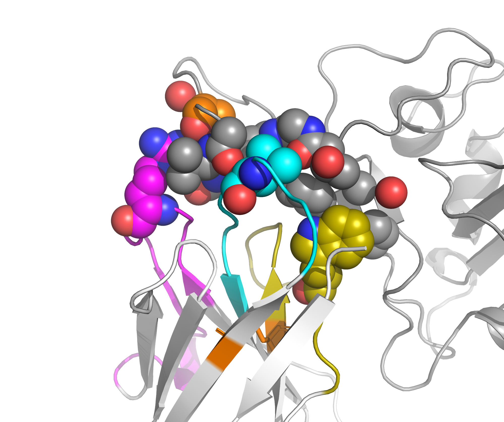

# Protein-Protein Affinity Optimisation Pipeline

A comprehensive computational pipeline for improving protein-protein binding affinity through systematic mutagenesis analysis using FoldX.

## Table of Contents

- [Biological Background](#biological-background)
- [Pipeline Overview](#pipeline-overview)
- [Quick Start with Makefile](#quick-start-with-makefile)
- [Detailed Script Documentation](#detailed-script-documentation)
- [Workflow Examples](#workflow-examples)
- [Dependencies](#dependencies)
- [Output Files](#output-files)

## Biological Background

### Protein-Protein Affinity

Protein-protein affinity refers to the strength of non-covalent interactions between two protein molecules. High-affinity interactions are characterized by low dissociation constants (Kd) and favorable binding free energy (ΔG). Improving affinity is crucial for:

- **Therapeutic development**: Enhancing antibody-antigen interactions
- **Protein engineering**: Creating more stable protein complexes
- **Biosensor design**: Improving detection sensitivity
- **Drug discovery**: Optimizing protein inhibitors

### Computational Affinity Optimisation Strategy

This pipeline uses FoldX, an empirical force field-based method, to computationally predict the effect of mutations on binding affinity:

1. **Interface Identification**: Locate residues at the protein-protein interface where mutations will have the greatest impact

2. **Single-Point Mutagenesis Screening (PSSM)**:

   - Systematically mutate each interface residue to all 19 other amino acids
   - Calculate ΔΔG (change in binding free energy)
   - Negative ΔΔG indicates improved binding affinity

3. **Combinatorial Optimisation**:

   - Combine beneficial single mutations (ΔΔG < threshold)
   - Test double and triple mutants
   - Identify synergistic or additive effects

4. **Ranking and Selection**:
   - Rank variants by predicted binding energy
   - Select top candidates for experimental validation

### Key Metrics

- **ΔG (binding)**: Free energy of binding (lower = stronger binding)
- **ΔΔG**: Change in binding energy upon mutation (ΔG_mutant - ΔG_wildtype)
  - ΔΔG < 0: Mutation improves binding (favorable)
  - ΔΔG > 0: Mutation weakens binding (unfavorable)
  - ΔΔG ≈ 0: Neutral mutation

## Pipeline Overview

The pipeline consists of four main stages:

```
┌─────────────────────────────────────────────────────────────┐
│                    1. STRUCTURE PREPARATION                 │
│  Download PDB → Repair structure → Optimise side chains     │
└─────────────────────────────────────────────────────────────┘
                              ↓
┌─────────────────────────────────────────────────────────────┐
│                    2. INTERFACE ANALYSIS                    |
│  Identify interface → Extract interface residues            │
└─────────────────────────────────────────────────────────────┘
                              ↓
┌─────────────────────────────────────────────────────────────┐
│                  3. SINGLE MUTATION SCREENING               │
│  Generate mutations → Run PSSM → Parse results → Visualise  │
└─────────────────────────────────────────────────────────────┘
                              ↓
┌─────────────────────────────────────────────────────────────┐
│                  4. MULTI-MUTATION DESIGN                   │
│  Filter beneficial → Combine mutations → Rank variants      │
└─────────────────────────────────────────────────────────────┘
```

## Quick Start with Makefile

### Configuration

Edit variables at the top of the Makefile:

```makefile
PDB_ID := 8GZ5              # Your PDB structure ID
CHAIN_ID := B               # Target chain to mutate
OTHER_MOL := A              # Binding partner chain
DDG_THRESHOLD := -1.2       # ΔΔG cutoff for beneficial mutations
PARALLEL_JOBS := 7          # Number of parallel FoldX jobs
```

### Available Targets

View all available commands:

```bash
make help
```

### Complete Pipeline

Run the entire pipeline:

```bash
make all
```

This executes all steps automatically:

1. Structure preparation
2. Interface analysis
3. PSSM analysis
4. Multimutant analysis

### Individual Stages

Run specific stages independently:

```bash
# Stage 1: Structure Preparation
make download_pdb          # Download PDB file
make repair_pdb            # Repair structure with FoldX

# Stage 2: Interface Analysis
make identify_interface    # Identify interface residues
make extract_interface     # Extract interface for visualization

# Stage 3: PSSM Analysis (single mutations)
make pssm_analysis         # Complete PSSM workflow
# OR run steps individually:
make prepare_pssm_commands # Generate command files
make run_foldx_pssm       # Execute FoldX in parallel
make analyse_pssm_output  # Parse results and plot

# Stage 4: Multimutant Analysis (combinations)
make multimutant_analysis  # Complete multimutant workflow
# OR run steps individually:
make prepare_multimutant_commands
make run_foldx_pairs
make run_foldx_triplets
make analyse_multimutant_output
```

### Customization

Override configuration from command line:

```bash
make all PDB_ID=1A2Y CHAIN_ID=A OTHER_MOL=B DDG_THRESHOLD=-2.0
```

### Cleanup

Remove generated files:

```bash
make clean
```

## Detailed Script Documentation

### Structure Preparation

#### `download_pdb.py`

Downloads PDB structure files from the RCSB PDB database.

```bash
python scripts/download_pdb.py <pdb_id>
```

**Arguments:**

- `pdb_id`: PDB identifier (e.g., "8GZ5")

**Output:**

- `<pdb_id>.pdb`: Downloaded PDB structure file

**Example:**

```bash
python scripts/download_pdb.py 8GZ5
```

---

#### `run_foldx_repair.py`

Repairs PDB structures using FoldX RepairPDB command. This optimizes side chain conformations and removes clashes.

```bash
python scripts/run_foldx_repair.py <pdb_id>
```

**Arguments:**

- `pdb_id`: PDB identifier (without .pdb extension)

**Output:**

- `<pdb_id>_Repair.pdb`: Repaired structure
- `<pdb_id>_Repair.fxout`: FoldX repair statistics

**Example:**

```bash
python scripts/run_foldx_repair.py 8GZ5
```

### Interface Analysis

#### `run_foldx_analysecomplex.py`

Analyzes protein-protein complexes using FoldX AnalyseComplex to calculate binding energies and identify interface residues.

```bash
python scripts/run_foldx_analysecomplex.py <pdb_id> <chain1> <chain2>
```

**Arguments:**

- `pdb_id`: PDB identifier (without .pdb extension)
- `chain1`: First chain identifier (e.g., "A")
- `chain2`: Second chain identifier (e.g., "B")

**Output:**

- `Interaction_<pdb_id>_Repair_AC.fxout`: Binding energy analysis
- `Interface_Residues_<pdb_id>_Repair_AC.fxout`: Interface residue list

**Example:**

```bash
python scripts/run_foldx_analysecomplex.py 8GZ5 A B
```

---

#### `extract_interface.py`

Extracts interface residues for a specific chain and generates PyMOL selection commands for visualization.

```bash
python scripts/extract_interface.py <pdb_id> <chain_id>
```

**Arguments:**

- `pdb_id`: PDB identifier (without .pdb extension)
- `chain_id`: Chain identifier to extract

**Output:**

- PyMOL selection command printed to stdout

**Example:**

```bash
python scripts/extract_interface.py 8GZ5 B
# Output: select foldx_interface, chain B and resi 45 + 47 + 52 + 98 + 100
```

### Single Mutation Analysis (PSSM)

#### `generate_pssm_commands_file.py`

Generates FoldX PSSM (Position-Specific Scoring Matrix) commands for systematic single-point mutagenesis of protein residues.

```bash
python scripts/generate_pssm_commands_file.py <pdb_id> <other_chain> <target_chain> [options]
```

**Arguments:**

- `pdb_id`: PDB identifier (without .pdb extension)
- `other_chain`: Binding partner chain identifier
- `target_chain`: Chain to mutate
- `--full-sequence`: Scan all residues in the chain (default: interface residues only)

**Output:**

- `command_list.txt`: FoldX commands for parallel execution
- `pssm_results/`: Directory structure for outputs

**Features:**

- **Interface-only scan (default)**: Uses `Interface_Residues_{pdb_id}_Repair_AC.fxout` to limit scanning to interface residues only
  - Requires running `run_foldx_analysecomplex.py` first
  - Significantly reduces computation time (~80% for typical complexes)
  - Recommended for most analyses
- **Full sequence scan**: Tests mutations at every position in the target chain when `--full-sequence` is specified
  - Useful for comprehensive exploration
  - More computationally expensive

**Example:**

```bash
# Scan interface residues only (default, recommended)
python scripts/generate_pssm_commands_file.py 8GZ5 A B

# Scan all residues in chain B
python scripts/generate_pssm_commands_file.py 8GZ5 A B --full-sequence

# Execute commands in parallel (7 jobs):
cat command_list.txt | xargs -P 7 -I {} sh -c '{}'
```

**Performance Comparison:**

For a typical antibody-antigen complex:

- Interface only (~20 residues): ~380 FoldX runs (19 amino acids × 20 positions) - **DEFAULT**
- Full sequence (~120 residues): ~2,280 FoldX runs (19 amino acids × 120 positions)
- **Default mode saves ~80% computation time**

---

#### `parse_pssm_output.py`

Parses PSSM output files and compiles ΔΔG values for all single mutations into a comprehensive table.

```bash
python scripts/parse_pssm_output.py <pdb_id> <target_chain>
```

**Arguments:**

- `pdb_id`: PDB identifier (without .pdb extension)
- `target_chain`: Chain identifier that was mutated

**Output:**

- `<pdb_id>_pssm_output.csv`: Tab-separated file with columns:
  - `position`: Residue position number
  - `wt`: Wild-type amino acid
  - `chain`: Chain identifier
  - `mut`: Mutant amino acid (1-letter code)
  - `mutant`: Mutant amino acid (3-letter code)
  - `part`: Structural region (CDR1/CDR2/CDR3/framework)
  - `wt_dG`: Wild-type binding energy
  - `mut_dG`: Mutant binding energy
  - `ddG`: ΔΔG (change in binding energy)
  - `mutant_code`: Mutation descriptor (e.g., "MA10Y")

**Example:**

```bash
python scripts/parse_pssm_output.py 8GZ5 B
```

---

#### `plot_pssm_heatmap.py`

Generates a clustered heatmap visualization of mutation effects across all positions and amino acids.

```bash
python scripts/plot_pssm_heatmap.py <pdb_id>
```

**Arguments:**

- `pdb_id`: PDB identifier (without .pdb extension)

**Input:**

- `<pdb_id>_pssm_output.csv`: Parsed PSSM results

**Output:**

- `<pdb_id>_Repair_interface_clustermap.png`: Heatmap showing:
  - Rows: Amino acid types
  - Columns: Protein positions
  - Colors: ΔΔG values (darker = more favorable)
  - Color bars: Structural regions (CDR1/2/3, framework)

**Example:**

```bash
python scripts/plot_pssm_heatmap.py 8GZ5
```

### Multi-Mutation Design

#### `generate_multimutant_commands_file.py`

Generates FoldX BuildModel commands for all pairwise and triple combinations of beneficial single mutations.

```bash
python scripts/generate_multimutant_commands_file.py <pdb_id> <ddg_threshold>
```

**Arguments:**

- `pdb_id`: PDB identifier (without .pdb extension)
- `ddg_threshold`: ΔΔG cutoff for filtering mutations (e.g., -1.0)
  - Only mutations with ΔΔG ≤ threshold are combined

**Input:**

- `<pdb_id>_pssm_output.csv`: PSSM results

**Output:**

- `command_list_pairs.txt`: Commands for double mutants
- `command_list_triplets.txt`: Commands for triple mutants
- `pairs_results/`: Output directories for pairs
- `triplets_results/`: Output directories for triplets

**Features:**

- Automatically filters out combinations affecting the same position
- Creates individual mutation list files for each variant
- Generates parallel execution commands

**Example:**

```bash
python scripts/generate_multimutant_commands_file.py 8GZ5 -1.0

# Execute in parallel:
cat command_list_pairs.txt | xargs -P 7 -I {} sh -c '{}'
cat command_list_triplets.txt | xargs -P 7 -I {} sh -c '{}'
```

---

#### `analyse_multivariants.py`

Compiles and ranks results from multi-mutant FoldX calculations. Automatically generates PyMOL visualization scripts for each variant.

```bash
python scripts/analyse_multivariants.py <pdb_id> [options]
```

**Arguments:**

- `pdb_id`: PDB identifier (without .pdb extension)
- `--chain-a`: Chain identifier for binding partner (default: A)
- `--chain-b`: Chain identifier for target chain with mutations (default: B)
- `--chain-a-name`: Display name for chain A in PyMOL (default: partner)
- `--chain-b-name`: Display name for chain B in PyMOL (default: target)
- `--no-pymol`: Skip PyMOL visualization script generation

**Input:**

- `pairs_results/`: Double mutant FoldX outputs
- `triplets_results/`: Triple mutant FoldX outputs

**Output:**

- `<pdb_id>_multivariants_output.csv`: Ranked results with columns:
  - `variant`: Mutation combination (e.g., "MA10Y_SB52T")
  - `total energy`: Total binding energy
  - Plus all FoldX energy components
- `<variant_folder>/visualise.pml`: PyMOL visualization script for each variant

**Features:**

- Automatically extracts mutation positions from variant names
- Generates ready-to-use PyMOL scripts in each variant folder
- Shows top 10 variants by total energy
- Provides PyMOL usage instructions

**PyMOL Script Features:**

Each generated `visualise.pml` script includes:

- Cartoon representation with color-coded chains
- Highlighted mutated residues (yellow spheres)
- Contact residues on partner chain (salmon spheres)
- CDR regions colored (cyan/magenta/olive)
- Disulfide bridges shown as sticks
- Auto-zoom on mutation sites

**Example:**

```bash
# Basic usage
python scripts/analyse_multivariants.py 8GZ5

# Custom chain names for visualization
python scripts/analyse_multivariants.py 8GZ5 \
  --chain-a A --chain-b B \
  --chain-a-name "antigen" --chain-b-name "antibody"

# Skip PyMOL script generation
python scripts/analyse_multivariants.py 8GZ5 --no-pymol
```

**Visualizing Results:**

After running the analysis, visualize any variant:

```bash
# Navigate to variant folder
cd triplets_results/9FWW_Repair_TB28Y_TB58R_SB104F

# Launch PyMOL
pymol visualise.pml
```

**Example Visualisations:**


_Triple mutant SB30L_NB54R_YB109W showing CDR1, CDR2 and CDR3 in colours (magenta, cyan, yellow),
and mutation sites and contact residues highlighted in spheres_

### Utilities

#### `utils.py`

Core utility functions used throughout the pipeline.

**Functions:**

- `extract_sequence_from_pdb(pdb_file, chain_id)`: Extracts residue information from PDB files
  - Returns: List of (residue_name, chain, position) tuples

**Constants:**

- `D3TO1`: Dictionary mapping 3-letter to 1-letter amino acid codes
- `AA_LIST`: List of all standard amino acids (3-letter codes)
- `CDR1`, `CDR2`, `CDR3`: Position ranges for CDR regions

**Example usage:**

```python
from utils import extract_sequence_from_pdb, D3TO1

sequence = extract_sequence_from_pdb("9FWW_Repair.pdb", "B")
# Returns: [('MET', 'B', '1'), ('ALA', 'B', '2'), ...]

one_letter = D3TO1['ALA']  # Returns 'A'
```

#### `foldx_wrapper.py`

Python wrapper for executing FoldX commands programmatically.

**Class: FoldXRunner**

Methods:

- `repair_pdb(pdb_id)`: Repairs PDB structure
- `analyse_complex(pdb_id, chain1, chain2)`: Analyzes protein complex

**Example usage:**

```python
from foldx_wrapper import FoldXRunner

runner = FoldXRunner()
result = runner.repair_pdb("9FWW")
result = runner.analyse_complex("9FWW", "A", "B")
```

## Workflow Examples

### Complete Analysis for Antibody-Antigen Complex (9FWW)

This example optimizes the binding of an antibody (chain B) to an antigen (chain A).

```bash
# Configure
export PDB_ID=8GZ5
export CHAIN_ID=B      # Antibody chain to optimize
export OTHER_MOL=A     # Antigen chain
export DDG_THRESHOLD=-1.5

# 1. Structure Preparation
make download_pdb
make repair_pdb

# 2. Interface Analysis
make identify_interface
make extract_interface

# 3. Single Mutation Screening (30-120 min depending on interface size)
make prepare_pssm_commands
make run_foldx_pssm       # Runs in parallel
make analyse_pssm_output   # Generates CSV and heatmap

# Review results
head ${PDB_ID}_pssm_output.csv
# Look for mutations with large negative ddG values

# 4. Multi-Mutation Design (2-8 hours depending on combinations)
make prepare_multimutant_commands
make run_foldx_pairs      # Test all double mutants
make run_foldx_triplets   # Test all triple mutants

# 5. Analyze and Rank
make analyse_multimutant_output

# Review top variants
head ${PDB_ID}_multivariants_output.csv | column -t
```

### Running on HPC/Cluster

For large-scale analysis, adjust parallel jobs:

```bash
make run_foldx_pssm PARALLEL_JOBS=32
make run_foldx_pairs PARALLEL_JOBS=32
make run_foldx_triplets PARALLEL_JOBS=32
```

### Custom Analysis with Different Thresholds

Test multiple ΔΔG thresholds to find optimal balance between number of variants and expected improvement:

```bash
# Strict threshold (fewer, higher-confidence mutations)
make prepare_multimutant_commands DDG_THRESHOLD=-2.0

# Moderate threshold (balanced)
make prepare_multimutant_commands DDG_THRESHOLD=-1.5

# Permissive threshold (more mutations, higher uncertainty)
make prepare_multimutant_commands DDG_THRESHOLD=-1.0
```

### Python Script Workflow (without Makefile)

```bash
# Variables
PDB_ID="8GZ5"
CHAIN_ID="B"
OTHER_MOL="A"
DDG_THRESHOLD=-1.5

# Structure preparation
python scripts/download_pdb.py $PDB_ID
python scripts/run_foldx_repair.py $PDB_ID

# Interface analysis
python scripts/run_foldx_analysecomplex.py $PDB_ID $OTHER_MOL $CHAIN_ID
python scripts/extract_interface.py $PDB_ID $CHAIN_ID

# PSSM analysis
python scripts/generate_pssm_commands_file.py $PDB_ID $OTHER_MOL $CHAIN_ID
cat command_list.txt | xargs -P 7 -I {} sh -c '{}'
python scripts/parse_pssm_output.py $PDB_ID $CHAIN_ID
python scripts/plot_pssm_heatmap.py $PDB_ID

# Multimutant analysis
python scripts/generate_multimutant_commands_file.py $PDB_ID $DDG_THRESHOLD
cat command_list_pairs.txt | xargs -P 7 -I {} sh -c '{}'
cat command_list_triplets.txt | xargs -P 7 -I {} sh -c '{}'
python scripts/analyse_multivariants.py $PDB_ID
```

## Dependencies

### FoldX Software

- **FoldX 5.0+**: Required for energy calculations
- License: Academic or commercial license required
- Download: https://foldxsuite.crg.eu/
- Installation: Place `foldx` executable in current directory or add to PATH

### Python Requirements

```bash
pip install pandas numpy matplotlib seaborn biopython scipy
```

**Package versions (recommended):**

- Python >= 3.8
- pandas >= 1.3.0
- numpy >= 1.21.0
- matplotlib >= 3.4.0
- seaborn >= 0.11.0
- biopython >= 1.79
- scipy >= 1.7.0

### System Requirements

- **Memory**: 4-8 GB RAM (more for large complexes)
- **Storage**: 1-10 GB per analysis (depending on number of mutations)
- **CPU**: Multi-core recommended for parallel execution
- **OS**: Linux or macOS (Windows via WSL)

## Output Files

### Structure Files

- `<pdb_id>.pdb`: Original downloaded structure
- `<pdb_id>_Repair.pdb`: FoldX-repaired structure
- `<pdb_id>_Repair.fxout`: Repair statistics

### Interface Analysis

- `Interaction_<pdb_id>_Repair_AC.fxout`: Binding energy decomposition
- `Interface_Residues_<pdb_id>_Repair_AC.fxout`: Interface residue list

### Single Mutation Results

- `<pdb_id>_pssm_output.csv`: Complete PSSM matrix with ΔΔG values
  - Columns: position, wt, chain, mut, mutant, part, wt_dG, mut_dG, ddG, mutant_code
- `<pdb_id>_Repair_interface_clustermap.png`: Heatmap visualization
- `pssm_results/`: Raw FoldX outputs for each position

### Multi-Mutation Results

- `<pdb_id>_multivariants_output.csv`: Ranked multi-mutant energies
  - Columns: variant, total energy, plus FoldX energy components
- `command_list_pairs.txt`: Double mutant command list
- `command_list_triplets.txt`: Triple mutant command list
- `pairs_results/`: Individual double mutant outputs
- `triplets_results/`: Individual triple mutant outputs

### Command Files

- `command_list.txt`: PSSM analysis commands
- `command_list_pairs.txt`: Pair variant commands
- `command_list_triplets.txt`: Triplet variant commands

## Interpreting Results

### ΔΔG Values

- **ΔΔG < -2.0 kcal/mol**: Strong improvement (high confidence)
- **-2.0 < ΔΔG < -1.0**: Moderate improvement
- **-1.0 < ΔΔG < 0**: Weak improvement (lower confidence)
- **ΔΔG ≈ 0**: Neutral mutation
- **ΔΔG > 0**: Destabilizing mutation

### Combining Mutations

- **Additive effects**: ΔΔG(A+B) ≈ ΔΔG(A) + ΔΔG(B)
- **Synergistic effects**: ΔΔG(A+B) < ΔΔG(A) + ΔΔG(B) (more favorable)
- **Antagonistic effects**: ΔΔG(A+B) > ΔΔG(A) + ΔΔG(B) (less favorable)

### Validation Strategy

1. **Computational validation**:

   - Check structural clashes in mutant models
   - Verify conservation of key interactions
   - Compare multiple modeling methods (Rosetta, AlphaFold2)

2. **Experimental validation**:
   - Start with top 5-10 predicted variants
   - Test single mutants first
   - Validate top combinations
   - Measure actual binding affinity (SPR, ITC, ELISA)

## Troubleshooting

### FoldX Errors

**"PDB file not found"**

- Ensure PDB file is in current directory
- Check PDB ID spelling
- Verify file has been repaired (\_Repair.pdb)

**"Chain not found"**

- Check chain IDs match PDB file
- Use uppercase chain identifiers
- Verify chains are present in repaired structure

### Python Errors

**"Module not found"**

```bash
pip install -r requirements.txt
```

**"Cannot read PSSM output"**

- Ensure FoldX PSSM commands completed successfully
- Check `pssm_results/` directory for output files
- Verify file naming matches expected format

### Performance Issues

**PSSM analysis too slow**

- Increase `PARALLEL_JOBS` in Makefile
- Run on cluster/HPC with more cores
- Split command_list.txt into chunks

**Out of memory**

- Reduce number of parallel jobs
- Process smaller interface regions
- Use machines with more RAM

## References

### FoldX Documentation

- FoldX Suite: https://foldxsuite.crg.eu/
- FoldX Manual: https://foldxsuite.crg.eu/documentation

### Related Publications

- Schymkowitz et al. (2005). "The FoldX web server: an online force field." _Nucleic Acids Research_
- Guerois et al. (2002). "Predicting changes in the stability of proteins and protein complexes." _Journal of Molecular Biology_

---

**Last Updated**: 2025
