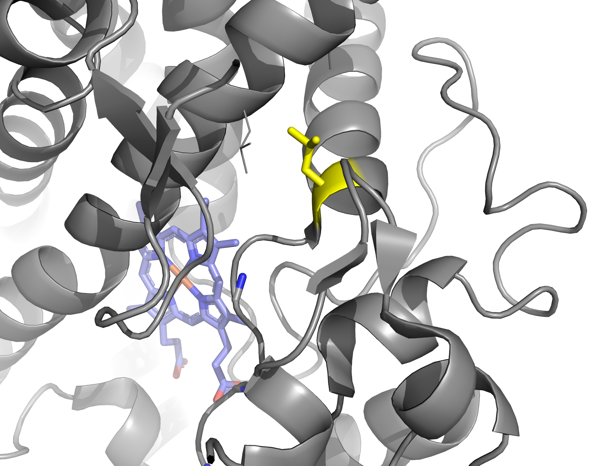

# Tutorial: estimating the stability effect of a mutation with FoldX 5.1

## Introduction:

Here is a brief tutorial on how to use FoldX 5.1 (<https://foldxsuite.crg.eu/>) to estimate the
stability effect of a mutation in a 3D structure. The stability (ΔG) of a protein is defined by the
free energy, which is express in kcal/mol. The lower it is, the more stable it is. ΔΔG is difference
in free energy (in kcal/mol) between a wild-type and mutant. A mutation that brings energy (ΔΔG > 0
kcal/mol) will destabilise the structure, while a mutation that remove energy (ΔΔG < 0 kcal/mol)
will stabilise the structure. A common threshold is to say that a mutation has a significant effect
if ΔΔG is >1 kcal/mol, which roughly corresponds to the energy of a single hydrogen bond.

A good way to compute the free energy is to use Molecular Dynamics (MD). Main problem: it can be
very time-consuming. FoldX uses an empirical method to estimate the stability effect of a mutation.

## Use cases

FoldX was used in many studies, i.e.:

- Tokuriki N, Stricher F, Serrano L, Tawfik DS. How protein stability and new functions trade off.
  PLoS Comput Biol. 2008 Feb 29;4(2):e1000002 <http://dx.doi.org/10.1371/journal.pcbi.1000002>

- Dasmeh P, Serohijos AW, Kepp KP, Shakhnovich EI. Positively selected sites in cetacean myoglobins
  contribute to protein stability. PLoS Comput Biol. 2013;9(3):e1002929.
  <http://dx.doi.org/10.1371/journal.pcbi.1002929>

And I personally used it in some of my studies:

- Studer RA, Christin PA, Williams MA, Orengo CA. Stability-activity tradeoffs constrain the
  adaptive evolution of RubisCO. Proc Natl Acad Sci U S A. 2014 Feb 11;111(6):2223-8.
  <http://dx.doi.org/10.1073/pnas.1310811111>

- Rallapalli PM, Orengo CA, Studer RA, Perkins SJ. Positive selection during the evolution of the
  blood coagulation factors in the context of their disease-causing mutations. Mol Biol Evol. 2014
  Nov;31(11):3040-56. <http://dx.doi.org/10.1093/molbev/msu248>

## Practical:

The executable is available here: <http://foldxsuite.crg.eu/>. You will have to register, but it is
free for Academics.

NB: I strongly encourage to read the manual (before or in parallel of this tutorial):
<https://foldxsuite.crg.eu/documentation>

=> Install the executable (i.e. `foldx_20251231`) in somewhere accessible and create a link:

```shell
ln -s foldx_20251231 foldx
```

The structure we will use as example is a bacterial cytochrome P450 (PDB:4TVF). You can download its
PDB file (4TVF.pdb) from here: http://www.rcsb.org/pdb/explore.do?structureId=4TVF

```shell
wget https://files.rcsb.org/download/4TVF.pdb
```

We would like to test the stability of mutation at position 280, from a leucine (L) to an aspartic
acid (D). Here is the original structure, with Leu280 in green, and residues around 6Å in yellow:


Bonus: code to generate the figure in PyMOL:

```
select cyt_P450, chain A
select heme, resn HEM
select L280, resi 280
hide everything
show cartoon, cyt_P450
show sticks, heme
show sticks, L280
colour grey60, cyt_P450
colour slate, heme
colour yellow, L280
select none
```

```
bg_color white
util.cnc
select none
set ray_opaque_background, 1
ray 2000
save 4TVF_L280.png
```



FoldX works in two steps:

## 1) Repair the structure

There are frequent problems in PDB structures, like steric clashes. FoldX will try to fix them and
lower the global energy (ΔG). The "RepairPDB" command is better than the "Optimize" command. Here is
how to launch FoldX:

```shell
foldx --command=RepairPDB \
      --pdb=4TVF.pdb \
      --ionStrength=0.05 \
      --pH=7 \
      --water=CRYSTAL \
      --vdwDesign=2 \
      --output-dir=. \
      --pdbHydrogens=false
```

We indicate which PDB file it needs to use, that we want to repair it (RepairPDB), that it will use
water and metal bonds from the PDB file (`--water=CRYSTAL`) and that we want a PDB as output
(`--output-dir=.`). All other parameter are by default.

This process is quite long (around 10 minutes). Here is the result (the original structure is now in
white, while the repaired structure is in yellow/green): 

We can see that some side chains have slightly moved (in particular Phe16).

The starting free energy ΔG was +73.22 kcal/mol, and it was lowered to -46.97 kcal/mol, which is now
stable (remember that a "+" sign means unstable while a "-" sign means stable).

Once it's finished, it will produce a file named "4TVF_Repair.pdb", which you will use in the next
step.

## 2) Perform the mutation

The mutation itself is performed by the BuildModel function. There are other methods, but the
BuildModel is apparently the most robust (I said apparently, but there are no proper benchmarks
against the other method PositionScan or PSSM). You also need to specify the mutation in a separate
file `individual_list.txt`, which will be just one line (one per mutant):

```
LA280D;
```

```shell
echo "LA280D;\n" > individual_list.txt
```

It contains the starting amino acid (L), the chain (A), the position (280) and the amino acid you
want at the end (D). One line correspond to one mutant. It means you can mutate many residues at the
same per line (mutant) and also produce different mutants by different numbers of lines.

In the following command line, you will see that is `4TVF_Repair.pdb` and not `4TVF.pdb` that is
mutated. You will also notice `--numberOfRuns=3`. This is because some residues can have many
rotamers and could have some convergence problems. You may to increase this values to 5 or 10, in
case you are mutating long residues (i.e. Arginine) that have many rotamers.

You can run it by:

```shell
foldx --command=BuildModel \
      --pdb=4TVF_Repair.pdb \
      --mutant-file=individual_list.txt \
      --ionStrength=0.05 \
      --pH=7 \
      --water=CRYSTAL \
      --vdwDesign=2 \
      --output-dir=. \
      --pdbHydrogens=false \
      --numberOfRuns=3
```

It is much faster this time (i.e. a few seconds) and will produce many files.

FoldX will first mutate the target residue (L) to itself (L) and move it as well as all neighbouring
side chains multiple times. We can see that Leu280 (green) was rotated: 

=> This is will give the free energy of the wild-type (let's call it `ΔGwt`).

Then, it will mutate the target residue (L) to the desired mutant (D) and move it as well as all
neighbouring side chains multiple times. We can see that Leu280 is mutated to Asp280 (see the two
oxygen atoms in red): 

=> This is will give the free energy of the mutant (let's call it `ΔGmut`).

The difference in free energy (ΔΔG) is given by `ΔGmut`-`ΔGwt`.

In the file `Raw_4TVF_Repair.fxout`, you can retrieve the energy of the three runs for both WT and
Mutant.

Run1:

- ΔGmut = 4TVF_Repair_1.pdb = -37.8602 kcal/mol
- ΔGwt = WT_4TVF_Repair_1_0.pdb = -42.2332 kcal/mol
- => ΔΔG = ΔGmut-ΔGwt = (-37.8602)-(-42.2332) = +4.373 kcal/mol

One file contains the average difference over all runs: `Average_4TVF_Repair.fxout`.

(You will notice that the difference in free energy ΔΔG is +4.29 kcal/mol \[+- 0.06 kcal/mol\]).

=> It means the mutation L280D is highly destabilising (positive value, and much above 1.0
kcal/mol).

PS: A way to define the threshold is to use the standard deviation (SD) by multiple:

The reported accuracy of FoldX is 0.46 kcal/mol (i.e., the SD of the difference between ΔΔGs
calculated by FoldX and the experimental values). We can bin the ΔΔG values into seven categories:

1. highly stabilising (ΔΔG < −1.84 kcal/mol);
2. stabilising (−1.84 kcal/mol ≤ ΔΔG < −0.92 kcal/mol);
3. slightly stabilising (−0.92 kcal/mol ≤ ΔΔG < −0.46 kcal/mol);
4. neutral (−0.46 kcal/mol < ΔΔG ≤ +0.46 kcal/mol);
5. slightly destabilising (+0.46 kcal/mol < ΔΔG ≤ +0.92 kcal/mol);
6. destabilising (+0.92 kcal/mol < ΔΔG ≤ +1.84 kcal/mol);
7. highly destabilising (ΔΔG > +1.84 kcal/mol).
